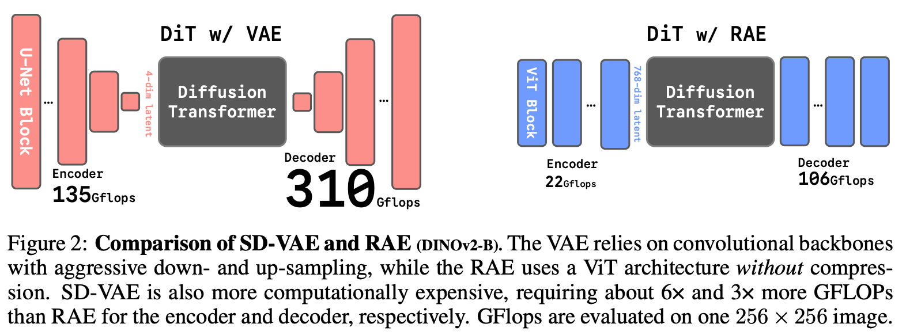
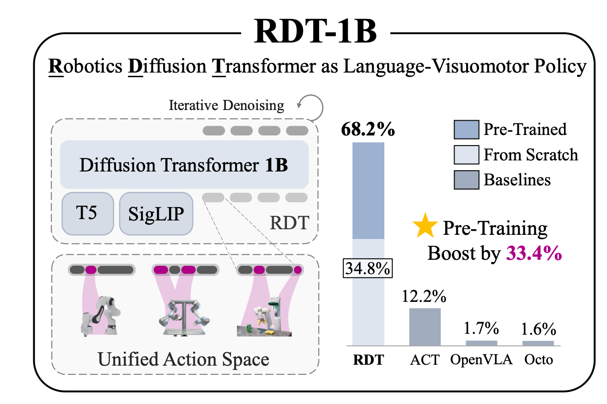

# VLA（Vision–Language–Action）核心技术与主要方案

## 目录（Table of Contents）

- [VLA（Vision–Language–Action）调研报告](#vla-visionlanguageaction-调研报告)
  - [1. 背景引入](#1-背景引入)
    - [1.1 概念与发展脉络](#11-概念与发展脉络)
    - [1.2 产业落地需求](#12-产业落地需求)
    - [1.3 技术演进趋势](#13-技术演进趋势)
  - [2. 核心技术](#2-核心技术)
    - [2.1 理解基座（V+L → Action）](#21-理解基座vl--action)
    - [2.2 信息表征（如何处理视觉/文本/动作）](#22-信息表征如何处理视觉文本动作)
    - [2.3 特征传递（理解模型 → 生成/控制模型 的桥接）](#23-特征传递理解模型--生成控制模型-的桥接)
    - [2.4 动作生成（扩散 / 流匹配 的关键做法）](#24-动作生成-扩散--流匹配-的关键做法)
    - [2.5 任务规划（会想再去做，并保证完备性）](#25-任务规划会想再去做并保证完备性)
  - [3. 方案与架构](#3-方案与架构)
    - [3.1 自回归架构](#31-自回归架构)
      - [3.1.1 OpenVLA（7B 开源 VLA，业界通用强基线）](#311-openvla7b-开源-vla业界通用强基线--202409--github)
      - [3.1.2 π₀-FAST（openpi）](#312-π₀-fastopenpi--202501--github)
    - [3.2 扩散/流匹配架构（Diffusion / Flow Matching）](#32-扩散流匹配架构diffusion--flow-matching)
      - [3.2.1 π₀.₅（openpi，流匹配动作头，开放世界泛化）](#321-π₀₅openpi流匹配动作头开放世界泛化--202504--github)
      - [3.2.2 RDT-1B（Robotics Diffusion Transformer）](#322-rdt-1brobotics-diffusion-transformer--202505--github--iclr-2025)
    - [3.3 商业闭源参考方案](#33-商业闭源参考方案)
      - [3.3.1 Seed GR-3（ByteDance Seed）](#331-seed-gr-3bytedance-seed--202507)
      - [3.3.2 Gemini Robotics（Google DeepMind）](#332-gemini-roboticsgoogle-deepmind--202509)
      - [3.3.3 Isaac GR00T N1（NVIDIA）](#333-isaac-gr00t-n1nvidia)
  - [4. 落地展望（要点）](#4-落地展望要点)
    - [4.1 基于开源方案的快速落地技术路线（两种备选）](#41-基于开源方案的快速落地技术路线两种备选)
    - [4.2 数据源与数据飞轮](#42-数据源与数据飞轮)
    - [4.3 可支持的业务场景（方向级）](#43-可支持的业务场景方向级)

---

## 1. 背景引入

### 1.1 概念与发展脉络
- **定义**：**VLA（Vision–Language–Action）** 模型通过统一的多模态表示，将**视觉感知**、**自然语言理解**和**动作规划**耦合在一起，以支持机器人在开放世界执行复杂任务。  
- **发展脉络**：早期机器人策略依赖**硬编码**或**纯视觉/状态输入**；2019–2021 年涌现的 **Vision–Language（VL）** 模型（如 **CLIP、BLIP**）在感知与语义理解上取得突破；**SayCan、PaLM-SayCan** 等把 **LLM** 引入机器人决策；2022 年谷歌推出 **RT-1**，首次以大规模真实机器人数据训练 **Transformer**；2023–2024 年出现 **RT-2、PaLM-E、π 系列、Diffusion Policy** 等面向通用机器人智能的 **VLA** 模型。  
- **核心目标**：在单一模型中实现“**看懂场景 — 理解任务 — 输出动作**”，使机器人具备**泛化能力**和**零样本/少样本适应**能力。

### 1.2 产业落地需求
- **长尾任务**：家庭、仓储、制造等场景存在庞大且多变的任务组合，传统专用机器人难以覆盖。  
- **人机交互成本**：通过**自然语言**描述任务，减少对示教器或编程的依赖，提高部署效率。  
- **全链条自动化**：机器人从**感知到执行**的闭环，减少人工监控和中间件依赖，推动**柔性自动化**。

### 1.3 技术演进趋势
- **数据驱动**：从**手工策略**转向“**数据 + 大模型**”范式，强调**多源、多模态、跨域**数据的利用。  
- **模型统一**：使用**单一 Transformer / 扩散器**处理视觉、语言、动作序列，减少模块化设计的**误差累积**。  
- **开放世界泛化**：从**封闭集任务**走向**开放环境**，对 **zero-shot / few-shot** 能力提出要求。  
- **实时与安全**：在保证泛化的同时，关注**延迟、可靠性、安全性、可解释性**。

---

## 2. 核心技术

### 2.1 理解基座（**V+L → Action**）

1) 用强视觉主干（**SigLIP / DINOv2** 等）+ 语言主干（**Llama / Qwen** 等）做**多模态对齐**，再把视觉 **token** 通过**投影头**送入 **LLM**，形成**可指令化**的通用理解基座。  
2) 随后在 **VLA** 场景上再训练**动作头**（**自回归**或**扩散/流匹配**）。以 **OpenVLA** 为代表的开源基座，已给出**端到端链路**与**复现实践**。

### 2.2 信息表征（**如何处理视觉/文本/动作**）

- **问题**：传统“**像素 → VAE 潜空间 → 生成/控制**”链条，潜空间**压缩过度、语义稀薄**，不利于下游（包括**动作扩散头**）稳定学习。 
    - **架构老旧**：它基于卷积网络，与现代Transformer驱动的DiT架构显得格格不入
    - **信息瓶颈**：它将图像极度压缩到一个低维度的潜在空间（例如，将256x256的图像压缩到32x32x4），这不可避免地会丢失大量细节
    - **语义贫乏**：VAE的训练目标仅仅是“重建”目标模态，导致其潜在空间虽然能保留模态的局部外观，但缺乏对内容的高层语义理解
- **近期方向**：  
  - **RAE（Representation Autoencoder）**  
    - 用**冻结的表征编码器**（如 **DINO、SigLIP、MAE**）替代 **VAE** 做“**潜空间编码**”，再配**轻量 ViT 解码器**；  
    - 在**高维、语义更强**的潜空间上训练 **DiT/扩散**，**收敛更快、质量更高**；  
    - 对 **VLA**：把更**语义化**的视觉潜表示**直接喂给动作头**（**扩散/流匹配/自回归**），减少“**像素 ↔ 动作**”错配。  
  - **SVG（Self-supervised representation for Visual Generation）**  
    - **移除 VAE**，直接在**自监督表征潜空间**做扩散；  
    - 以**残差分支**补细节、**卷积解码器**回像素；  
    - 对 **VLA**：在**统一自监督潜表示**中承载视觉语义与运动条件，更稳。

### 2.3 特征传递（**理解模型 → 生成/控制模型 的桥接**）

- **问题**：理解侧（**VLM/LLM**）输出**离散语义/推理特征**；生成/控制侧（**动作扩散/流匹配/离散解码**）需要**可条件化、连续且时序稳定**的表征。  
- **可行范式**：  
  - **MetaQuery**：通过一组**可学习查询向量**在**冻结多模态 LLM**与**扩散生成器**之间**传递/对齐语义**，避免端到端重训；同理可用于“**VLM → 动作扩散头**”的桥接（将**推理语义蒸馏**到控制条件）。  
  - **Connector/Adapter**：以**轻量连接器**把理解端**高层语义**投影到生成端**条件空间**；已有视觉生成工作对 **MetaQuery/Connector** 给出系统评测，**工程成熟**。  
- **要点**：  
  - 保持**时序条件**（历史观测/动作）与**任务语义**（文本、子目标）**双通道**输入；  
  - 面向**长程任务**，建议在桥接层显式携带**规划/子目标 latent**。

### 2.4 动作生成（**扩散 / 流匹配** 的关键做法）
- **连续扩散 / 流匹配**  
  - 在**连续动作或短轨迹**上做**条件去噪/流匹配**；  
  - 代表：
    - **Diffusion Policy**：
        - 视觉/状态编码器：将多视角 RGB（可含本体状态、历史动作）编码成时序特征；
        - 时间序列去噪器：时域 U-Net/Transformer 对“被加噪的动作序列”做条件去噪（条件=视觉/状态/指令 + 噪声时间步）；
        - 执行：生成长度 𝐻 的动作轨迹，用 RHC 每次执行前 𝑘 步并滚动更新。
    - **RDT-1B**：
        - 感知/语言条件：多视角 RGB → 视觉编码；文本指令 → 文本编码；拼接成条件序列；
        - 去噪主干：Diffusion Transformer（DiT） 直接对连续动作序列做去噪，一次并行预测 64 步动作（统一兼容单/双臂、关节/末端等接口）；
        - 训练/数据：在46 个数据集、100 万+ 回合上做模仿学习式去噪训练，另有 ALOHA 双臂精调；
        - 执行：可直接下发整段，或配 RHC。
    - **Dita**：
        - 原位条件化（in-context conditioning）：不再把视觉特征“融合成单向量”，而是把原始视觉 token 序列与被加噪的动作 token一起送入大号 Transformer 去噪器，细粒度对齐“历史观测 ↔ 动作增量”；
        - 建模内容：显式建模动作增量与环境细节，跨机体/多视角/多动作空间更鲁棒；
        - 训练/执行：标准扩散/少步采样套路，易与多源数据横向扩展。
    - **DiT-Block Policy**：面向扩散策略设计的**高性能条件噪声网络（Transformer 模块化块）**，以目标文本/本体状态/时间步嵌入为条件，提供可扩展的Goal-conditioned策略学习骨架。
  - 训练：**L2 / score / flow** 目标；推理：**并行采样/缓存/少步采样**。  
- **离散扩散**  
  - 先把动作**离散化**为 **token/动作块**，在**单体 Transformer** 内做**离散扩散**并用**交叉熵**训练（与 **VLM** 一致），支持**并行解码、二次掩码纠错**；  
  - 代表：
    - **Discrete Diffusion VLA**（与离散语言接口原生对齐）
        - 单体骨干：把原本自回归动作头改为双向注意力，在同一 Transformer里对离散化动作块执行离散扩散（不另挂外部连续扩散头）；
        - 训练目标：与 VLM 同一套交叉熵监督（离散复原），因此预训练先验保留好；
        - 推理技巧：自适应解码顺序（先解“容易的”维度/通道）、二次掩码重整（对高不确定 token 反复复原），并支持并行生成；
        - 执行：解码完成后去 token 化还原到连续关节/末端控制。
    - **DIVA（Discrete diffusion Vision-Language-Action）**
        - 动作表示：将动作/子动作编码为离散潜表示，在迭代去噪中逐步复原；
        - 条件化：视觉与语言通过投影接入，与“被破坏的动作 token”联合输入扩散网络；
        - 训练/推理：离散扩散范式，强调减小自回归误差累积与时间刚性；
        - 接口：与 VLM 的token 接口一致，易做统一大模型。
    - **DFMP（Discrete Flow Matching Policy，离散流匹配）**
        - 动作空间：将连续动作映射到离散空间；
        - 生成头：使用离散的 flow/score-based生成过程（与离散扩散同宗，目标为匹配离散分布的速度场/得分）；
        - 训练/推理：迭代复原离散动作，再反量化为连续控制；
        - 定位：当作“离散扩散的流匹配变体”，保留离散接口优势，同时享受 flow 的收敛/少步潜力。
    
- **工程关注点**：**并行/缓存加速、多视角条件、SE(3) 约束、少步采样与蒸馏**；

### 2.5 任务规划（**会想再去做，并保证完备性**）
- **主流范式**：  
  1) **LLM + 可供性/价值约束（SayCan 系）**：LLM 产出候选动作序列，用**可供性/价值**函数打分执行，**安全可控**，适合**长程任务**；  
  2) **内在独白/交互式反思（Inner Monologue）**：利用环境反馈形成“**思考 — 行动 — 再思考**”循环，提高**鲁棒性**与**异常处理**；  
  3) **显式视觉推理（CoT-VLA / ThinkAct）**：先预测**未来视觉目标帧 / 视觉计划 latent**，再生成**短动作序列**，兼顾**可解释**与**执行稳定**。  
- **完备规划栈要素**：  
  - **技能库/原语**（pick/place/开关/导航…）与**状态机/行为树接口**；  
  - **可供性/可达性评估**，**失败检测与异常分支**（重试/替代技能）；  
  - **记忆与检索**（任务历史、子目标缓存）、**再规划触发**（阈值/失败/观测突变）；  
  - **安全守护**（动作幅度/碰撞/地域限制）。

---

## 3. 方案与架构

### 3.1 自回归架构

#### 3.1.1 **OpenVLA**（7B 开源 VLA，业界通用强基线） · 2024.09 · [GitHub](https://github.com/openvla/openvla)

- **架构**：视觉端采用 **SigLIP + DINOv2** 融合视觉编码器；经**投影器**送入 **LLaMA-2/Prismatic-7B** 语言主干，**自回归预测离散动作 token**，再**解码**为可执行的**连续控制量**。  
- **训练方法**：在**预训练 VLM** 基座上**微调**；支持 **LoRA/PEFT**，强调**数据高效迁移**到**新机器人/新任务**。  
- **训练数据**：以 **Open-X-Embodiment** 汇总数据为主，覆盖 **≈97 万段**真实机器人示范，**跨平台/跨任务**多样化。

#### 3.1.2 **π₀-FAST（openpi）** · 2025.01 · [GitHub](https://github.com/Physical-Intelligence/openpi)

- **架构**：使用 **DCT（离散余弦变换）**将**连续控制离散化**为可学习 **token**；主干用 **VLM + 自回归解码头**，与语言/视觉 **token** 统一接口。  
- **训练方法**：提供**从零到微调**的开源**训练脚本与配置**。  
- **训练数据**：openpi 提供 **10k+ 小时**机器人数据上**预训练的基座与专家权重**（含 **DROID/ALOHA/LIBERO** 等），可**直接推理**或**再训练**。

### 3.2 扩散/流匹配架构（**Diffusion / Flow Matching**）

#### 3.2.1 **π₀.₅（openpi，流匹配动作头，开放世界泛化）** · 2025.04 · [GitHub](https://github.com/Physical-Intelligence/openpi)

- **架构**：采用 **Flow Matching** 作为**动作生成头**（仓库当前仅支持 **π₀.₅** 的 **flow-matching head**），与视觉/语言特征在同一**序列空间**内**条件生成动作**。  
- **知识隔离（Knowledge Insulation）**：  
  - **动机**：端到端并入**连续动作专家**会**拖慢训练**且**破坏 VLM 已学知识**；  
  - **训练期**：两路并行  
    - （A）**VLM 主干**：图像/文本/状态 → **预测离散动作 token**（**交叉熵**）；  
    - （B）**动作专家**：同条件下做**流匹配/扩散去噪**（**L2/flow** 目标），**梯度不回流**主干；  
  - **推理期**：**丢弃离散支路**，仅用**连续动作专家**生成**平滑、低延迟**控制。  
- **实现与数据**：提供 **JAX / PyTorch** 实现，支持 **LIBERO / DROID** 的**开源复现与微调**；基座在 **10k+ 小时**数据上预训练，并给出 **LIBERO/DROID** 微调与评测配置。

#### 3.2.2 **RDT-1B（Robotics Diffusion Transformer）** · 2025.05 · [GitHub](https://github.com/thu-ml/RoboticsDiffusionTransformer) · *ICLR 2025*

- **架构**：**扩散 Transformer 策略**，支持**多视角 RGB + 语言指令**条件，**一次预测 64 步动作**，兼容**单/双臂、关节/末端**等多执行接口，属“**可扩展轨迹扩散策略**”。  
- **训练数据**：融合 **46** 个数据集、**100 万+** 多机器人轨迹，并针对 **ALOHA 双臂**额外收集 **6k+** 集，覆盖广泛任务与形态。  

### 3.3 商业闭源参考方案

#### 3.3.1 **Seed GR-3（ByteDance Seed）** · 2025.07

- **架构**：通用 **VLA**，联合**视觉-语言**与**机器人轨迹**，支持**长程与可泛化**操作（含**可变形物体**）。  
- **训练方法**：**统一训练（V+L+Action）**，下游**少量人示范**即可**高效适配**。  
- **训练数据**：**视觉-语言语料 + 真实/仿真轨迹**混合。  
- **可用性**：技术报告与演示公开；**模型未开源**，商业产品化导向明确。

#### 3.3.2 **Gemini Robotics（Google DeepMind）** · 2025.09

- **架构**：**Gemini** 系列的**机器人定制版 VLA**（含 **On-Device** 与 **ER 1.5** 路线），强调在**多形态平台**上的**感知-推理-工具使用-行动**一体化；提供“**本地运行**”优化版本以满足**低时延/离线**需求。  
- **训练方法**：在**通用多模态基座**上做具身定制，支持**少量演示**的**快速自适应**；面向**可信测试者**提供 **SDK/工具链**。  
- **训练数据**：Google 内部**演示**（如 **ALOHA**）+ **跨平台迁移**记录（**Apollo、Franka** 等），细节未完全披露。

#### 3.3.3 **Isaac GR00T N1（NVIDIA）**
- **架构**：面向**人形**的**通用机器人基础模型（VLA）**，“**System-1 快速反射动作** + **System-2 深度推理/规划**”；与 **Omniverse** 合成数据、仿真与**数据飞轮**深度耦合。  
- **训练方法**：**条件扩散/Transformer** 范式，结合**自/合成/仿真**学习与**跨域蒸馏**；适配多家机器人平台。  
- **训练数据**：**自我采集 + 合作生态**（**第一人称人类视频、真实/仿真轨迹、合成数据**等混合）。  
- **可用性**：面向生态伙伴与开发者发布**可定制版本**与**数据/工具链**；总体**非完全开源**、以**商用生态**为目标。

## 4. 落地展望（要点）

### 4.1 基于开源方案的快速落地技术路线（两种备选）

- **方案 A（效果最优）：流匹配 / 连续扩散路线（π₀.₅ / RDT-1B）**
  - **适用**：需要**细腻接触**、**SE(3) 精确位姿**、**长时间窗**与**复杂约束**（开关/插拔/装配/柔性物体）。
  - **做法**：  
    1) 以 **π₀.₅** 为基座（**知识隔离**，flow-matching 动作头），先在 **DROID/LIBERO** 微调；  
    2) 对目标场景采**少量高质量演示**再适配；  
    3) 如需更长轨迹/多视角，接入 **RDT-1B（DiT 一次 64 步）**；  
    4) 部署侧启用 **少步采样/并行采样/KV 缓存**，并在控制层加入 **SE(3) 投影 + IK/QP 约束**。  
  - **优点/权衡**：动作**连续顺滑**、可处理**多峰分布**与**复杂接触**；对**算力与时延优化**要求更高，工程集成相对更重。

- **方案 B（落地最快）：自回归路线（OpenVLA / π₀-FAST）**
  - **适用**：**多平台通用操控**、语义指令到动作的**快速上线**与**验证**（收纳、拣取、开合、搬运等半结构化任务）。
  - **做法**：  
    1) 直接加载 **OpenVLA** 权重，按目标物体/场景做**LoRA 微调**；  
    2) 若需更平滑控制，用 **π₀-FAST** 做**动作离散化**统一接口，末端加**平滑/IK**；  
    3) 数据用 **Open-X-Embodiment + 少量自采演示** 即可跑通；  
    4) 以 **policy server** 接入评测/灰度，快速形成**数据飞轮**。  
  - **优点/权衡**：**上手最快、脚本与生态成熟**、成本低；在**极致接触精度/长程一致性**上不及方案 A，但可满足大多数**服务与后场作业**场景的首发需求。

---

### 4.2 数据源与数据飞轮
- **公共数据直连**：**Open-X-Embodiment、DROID、LIBERO、ALOHA** 等（优先同分布子集）；必要时用统一格式（如 **LeRobot**）做转换。
- **自采与轻量示范**：远程示教/VR/第一人称视频；少量高质量演示对**新物体/新场景**适配很有效。
- **仿真与合成**：**Isaac/Omniverse/Habitat** 生成可控长尾；**合成文字指令**与**程序化场景**扩大覆盖。
- **自动标注与弱监督**：多视角重建、语言描述对齐（LLM/VLM 生成标签）、成功/失败信号回流。
- **闭环飞轮**：线上部署产生的轨迹→离线清洗→定期再训练/蒸馏→灰度回放验证→小流量上线。

---

### 4.3 可支持的业务场景（方向级）
- **家庭/办公服务**：清理整理、开关/旋钮操作、物品搬运与分类、简单烹饪辅助、桌面任务（收纳/擦拭）。
- **仓储与零售后场**：拣选与再分拣、开箱/封箱、货架补货、条码面向调整、异常品处理。
- **轻制造与装配**：取放/插拔、螺栓/卡扣操作、工位上下料、治具操作、产线切换时的小批量柔性任务。
- **质检与实验室**：视觉质检辅助手爪触探、移液/开盖/取样等标准化动作序列。
- **巡检与运维**：门禁/阀门/按钮操作，简单工具使用（扳手/螺丝刀），异常点位取证。
